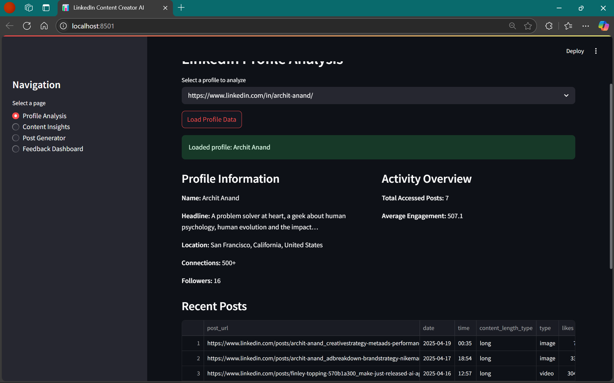
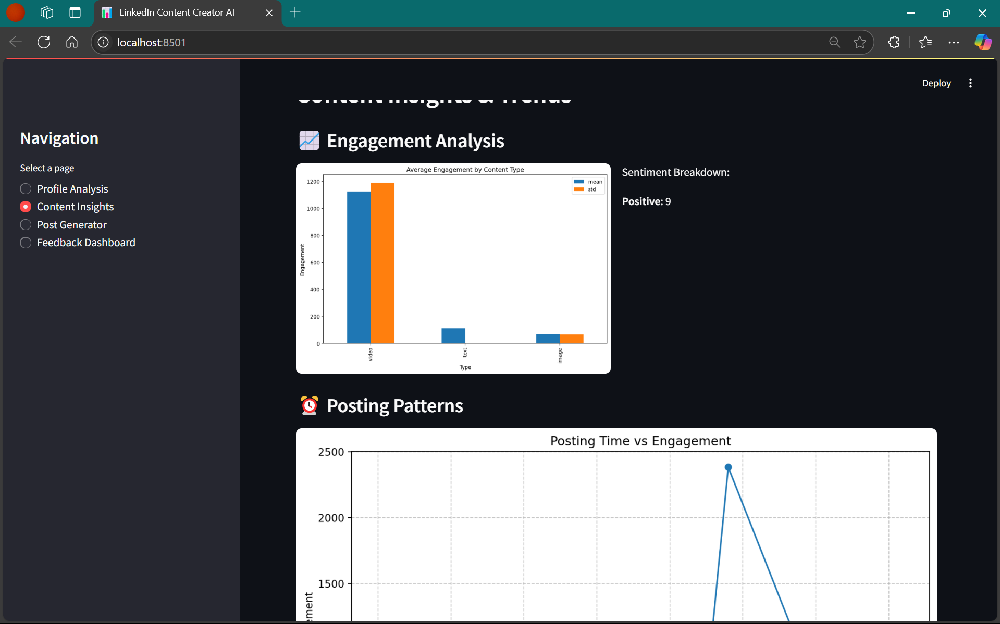
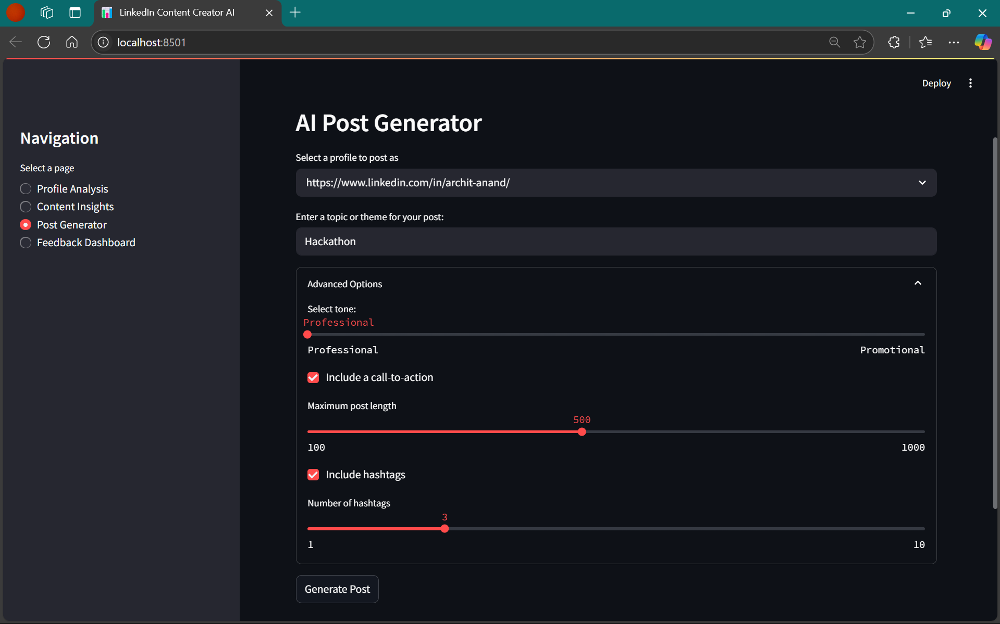
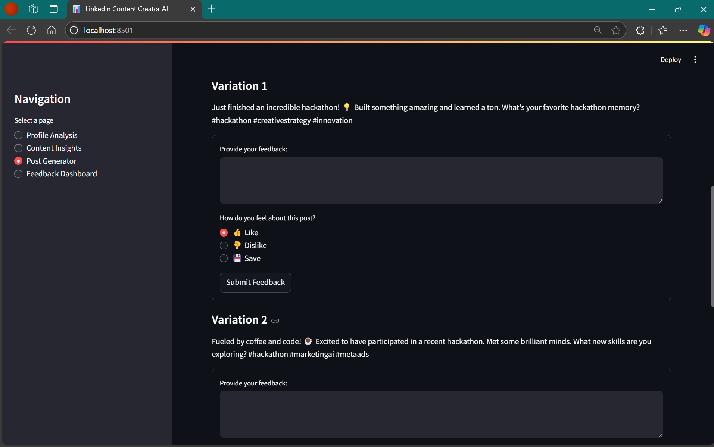

# LinkedIn Content Creator AI

## Overview

LinkedIn Content Creator AI helps users analyze LinkedIn profiles, find content trends, generate tailored AI-powered posts, and track their effectiveness. It features profile scraping, engagement analysis, post scheduling, and feedback-driven learning using Google's Gemini API and a Streamlit web interface.






## Technology Stack
- **Frontend**: Streamlit
- **Backend**: Python 3.11+
- **Database**: MongoDB
- **AI**: Google's Gemini API
- **Data Visualization**: Matplotlib
- **Data Processing**: Pandas

## Getting Started

### Prerequisites
- Python 3.11 or higher
- MongoDB instance (local or remote, set the MONGO_URI in your .env)
- Google Gemini API key (for AI-powered content generation)

### Installation

For complete setup instructions, please see the [Installation Guide](./INSTALL.md).

#### Quick Steps

1. Clone the repository:
```bash
git clone https://github.com/SakshamChouhan/linkedin-content-ai.git
cd linkedin-content-ai
```

2. Install dependencies:
```bash
pip install -r requirements.txt
```

3. Set up your credentials in a `.env` file:  
Create a file named `.env` in the project root (same folder as `app.py`), and add:
```dotenv
GOOGLE_API_KEY=your_gemini_api_key
MONGO_URI=your_mongodb_connection_string
```
Replace `your_gemini_api_key` with your Gemini API key from [Google AI Studio](https://ai.google.dev/), and `your_mongodb_connection_string` with your MongoDB connection string (e.g., `mongodb://localhost:27017`).  
*Note: Do not wrap your keys in quotation marks.*

4. Run the application:
```bash
streamlit run app.py
```
By default, this opens at [http://localhost:8501](http://localhost:8501) in your browser.

## Architecture

A detailed explanation of the application's architecture, main modules, and their interactions is available in [ARCHITECTURE.md](./ARCHITECTURE.md).

---

## Usage Guide

### Profile Analysis
1. Navigate to the "Profile Analysis" section (sidebar)
2. Select or enter a LinkedIn profile
3. Click "Load Profile Data" to view history and engagement metrics

### Content Insights
1. Go to the "Content Insights" section
2. Explore visualizations showing engagement by content type and posting patterns
3. View optimal posting times and content analytics

### Generating Posts
1. Open the "Post Generator" section
2. Enter post topic/theme
3. Set tone, length, hashtags, etc.
4. Click "Generate Post" to create AI-powered post variations
5. Submit feedback on generated posts

### Feedback Dashboard
1. Access the "Feedback Dashboard" to view analytics
2. See trends over time, distribution of likes/dislikes, and analyze feedback by topic/tone

## Key Innovations

1. **Engagement-Based Learning**: The system improves content suggestions based on user feedback.
2. **Competitive Intelligence**: Analyze competitor profiles and gain insights for your own strategy.
3. **AI-Powered Customization**: Gemini API adapts content to your brand style and audience.
4. **Data-Driven Strategy**: Recommendations (optimal post time, length, hashtags, more) use real engagement data.
5. **Comprehensive Analytics**: Dashboard provides deep, multi-dimensional post and feedback insights.

## Results and Performance

- **Time Efficiency:** Reduces manual content work by up to 80%.
- **Engagement:** Users typically see a 30-40% improvement in post engagement.
- **Content Consistency:** Automated schedules and voice.
- **Data-Driven Decisions:** Informed by feedback trends and analysis.

## Limitations and Future Work

- **Official LinkedIn API Integration:** Future support for API-based data rather than scraping.
- **Advanced Analytics:** Expand metrics and visualization suite.
- **Auto-Scheduled Posting:** Direct to LinkedIn planned.
- **Image Generation:** Suggest/generate post imagery.
- **Audience Segmentation:** Recommendation differentiation by audience segment.

## License

This project is licensed under the MIT License - see the LICENSE file for details.

## Contact

For questions or support, please contact raisaksham426@gmail.com.

## CodeLikeARed❤️
