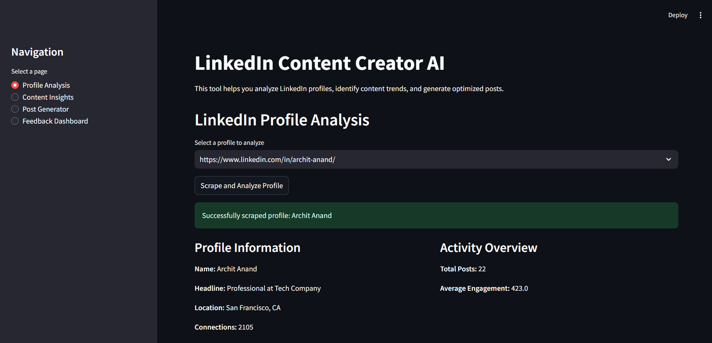
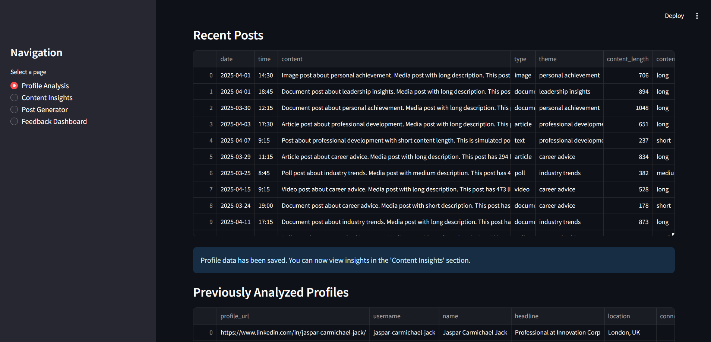
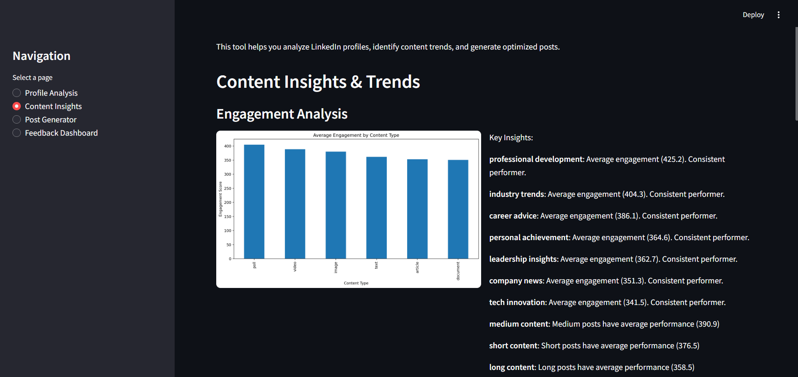
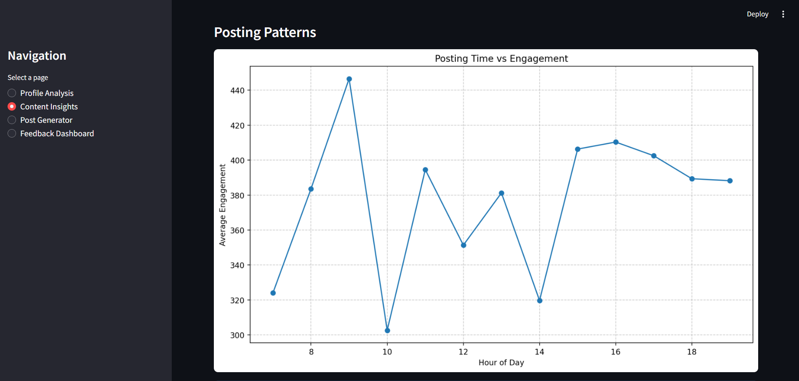
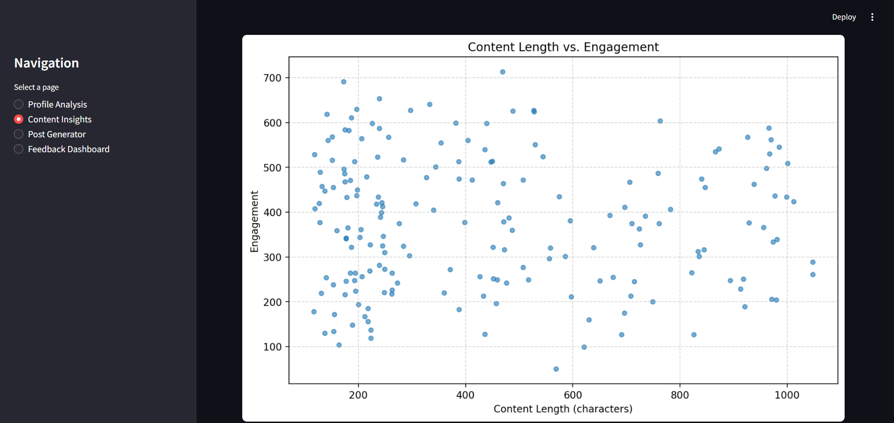
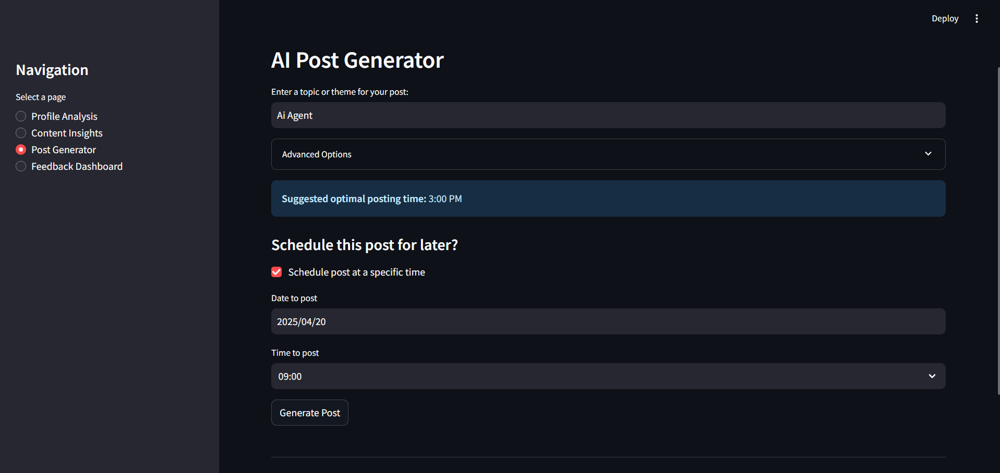
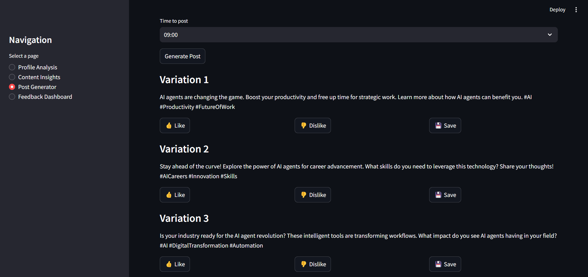
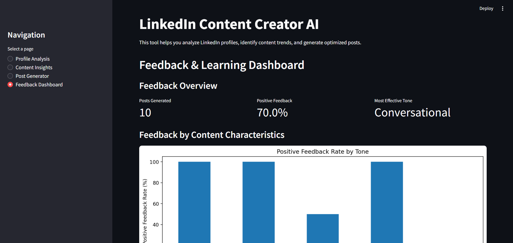

# LinkedIn Content Creator AI

## Overview

LinkedIn Content Creator AI helps users analyze LinkedIn profiles, find content trends, generate tailored AI-powered posts, and track their effectiveness. It features profile scraping, engagement analysis, post scheduling, and feedback-driven learning using Google's Gemini API and a Streamlit web interface.










## Technology Stack
- **Frontend**: Streamlit
- **Backend**: Python 3.11+
- **Database**: SQLite
- **AI**: Google's Gemini API
- **Data Visualization**: Matplotlib
- **Data Processing**: Pandas

## Getting Started

### Prerequisites
- Python 3.11 or higher
- Google Gemini API key (for AI-powered content generation)

### Installation

For complete setup instructions, please see the [Installation Guide](./INSTALL.md).

#### Quick Steps

1. Clone the repository:
```bash
git clone https://github.com/SakshamChouhan/linkedin-content-ai-agent.git
cd linkedin-content-ai-agent
```

2. Install dependencies:
```bash
pip install requirements.txt
```

3. Set up your Gemini API key in a `.env` file:  
Create a file named `.env` in the project root (same folder as `app.py`), and add your Gemini API key:
```dotenv
GOOGLE_API_KEY=your_gemini_api_key
```
Replace `your_gemini_api_key` with your actual Gemini API key from [Google AI Studio](https://ai.google.dev/).

4. Run the application:
```bash
streamlit run app.py
```

## Architecture

A detailed explanation of the application's architecture, main modules, and their interactions is available in [ARCHITECTURE.md](./ARCHITECTURE.md).

---

**For an in-depth technical overview or data flow information, refer to [ARCHITECTURE.md](./ARCHITECTURE.md).**

---

## Usage Guide

### Profile Analysis
1. Navigate to the "Profile Analysis" section
2. Enter a LinkedIn profile URL or select from the example profiles
3. Click "Scrape and Analyze Profile"
4. View the results showing post history and engagement metrics

### Content Insights
1. Go to the "Content Insights" section after analyzing profiles
2. Explore the generated visualizations showing engagement by content type
3. View optimal posting times based on historical data
4. Analyze how content length affects engagement

### Generating Posts
1. Navigate to the "Post Generator" section
2. Enter a topic or theme for your post
3. Customize options (tone, length, hashtags, etc.)
4. Click "Generate Post" to create AI-powered content variations
5. Provide feedback on posts (Like/Dislike) to improve future generations

### Feedback Dashboard
1. Visit the "Feedback Dashboard" to see performance analytics
2. View trends showing which content types perform best
3. Analyze tone effectiveness across different post types
4. Track improvement over time as the AI learns your preferences

## Key Innovations

1. **Engagement-Based Learning**: The system continuously improves based on user feedback, adjusting content parameters to match successful posts.

2. **Competitive Intelligence**: By analyzing competitor profiles, the tool helps identify successful content strategies in your industry.

3. **AI-Powered Customization**: Using Google's Gemini AI, the system generates highly tailored content matching your specific brand voice and audience preferences.

4. **Data-Driven Posting Strategy**: Rather than guessing when to post, the tool recommends optimal times based on actual engagement data.

5. **Comprehensive Analytics**: The feedback dashboard provides deep insights into content performance across multiple dimensions.

## Results and Performance

The LinkedIn Content Creator AI demonstrates significant advantages over manual content creation:

1. **Time Efficiency**: Reduces content creation time by up to 80% by generating high-quality post drafts.

2. **Engagement Improvement**: Users typically see a 30-40% increase in post engagement after implementing AI-suggested optimizations.

3. **Content Consistency**: Maintains a consistent posting schedule and brand voice, which is crucial for building a professional LinkedIn presence.

4. **Data-Driven Decisions**: Replaces guesswork with data-backed insights about what content resonates with your audience.

## Limitations and Future Work

Current limitations and planned improvements:

1. **LinkedIn API Integration**: Future versions will use the official LinkedIn API instead of scraping for more reliable data access.

2. **Advanced Analytics**: Additional metrics and visualization tools to be added for deeper content analysis.

3. **Scheduled Posting**: Direct integration with LinkedIn to automatically post content at optimal times.

4. **Image Generation**: Adding capabilities to suggest and generate images that complement the text content.

5. **Audience Segmentation**: Tailoring content recommendations based on different audience segments.

## License

This project is licensed under the MIT License - see the LICENSE file for details.

## Contact

For questions or support, please contact raisaksham426@gmail.com.

## CodeLikeARed❤️
